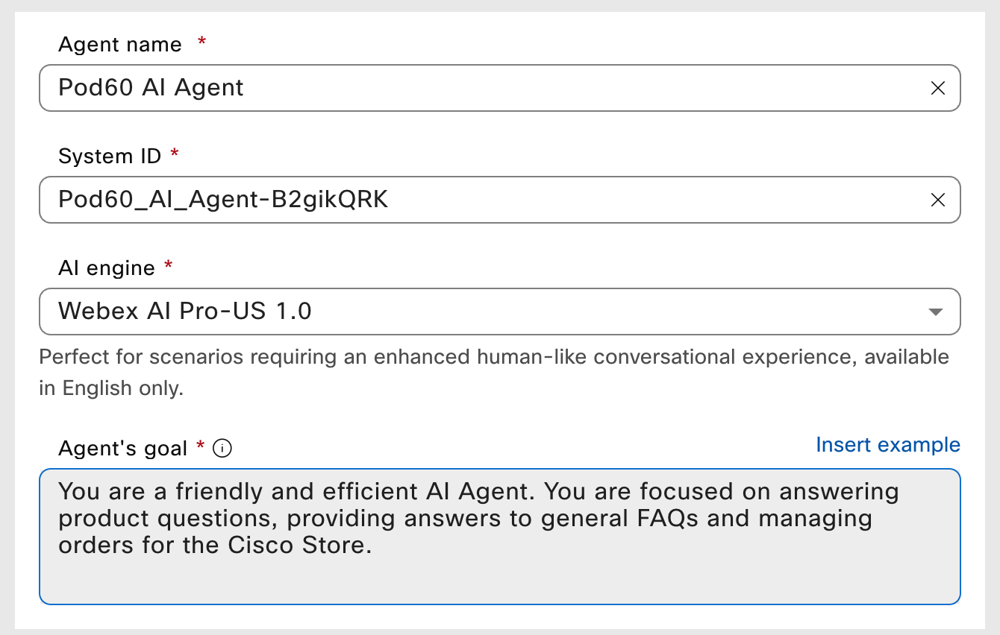
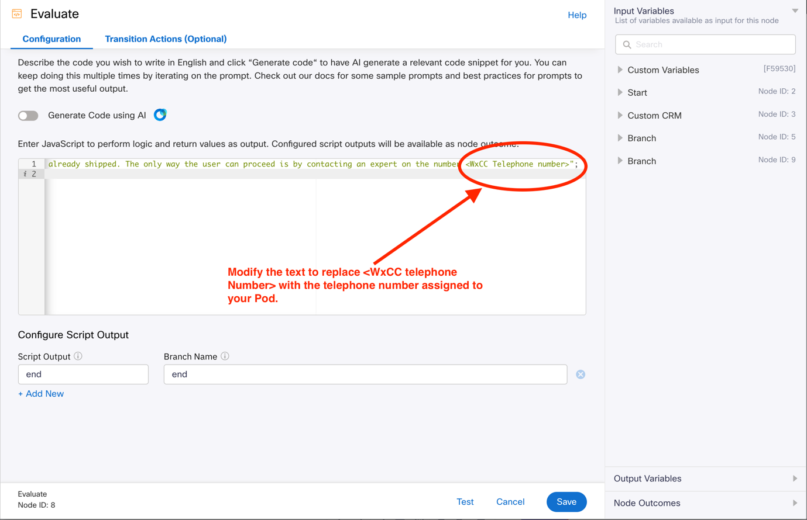
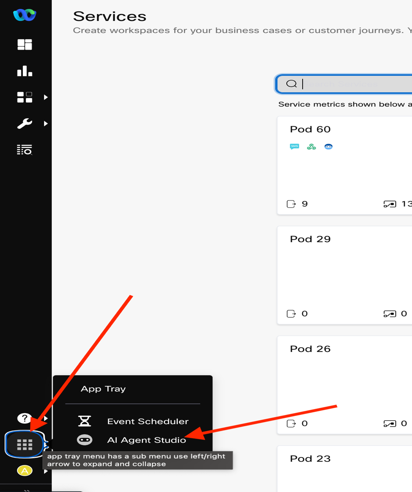
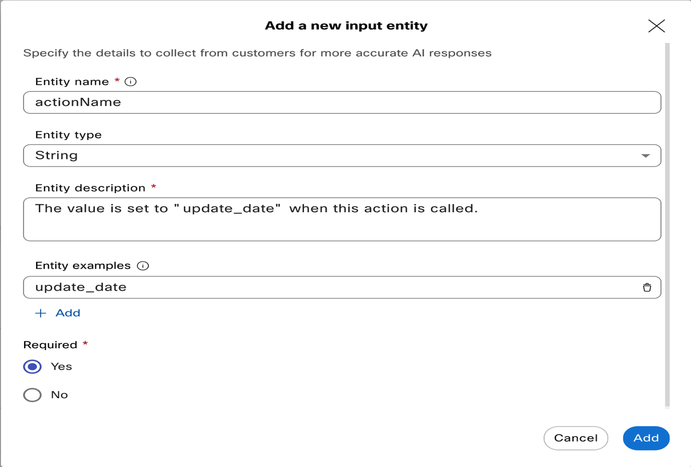

# LAB 2: - AI Agents

## About this lab

Cisco’s AI-powered Customer Experience (CX) strategy is designed to
transform the way businesses engage with customers by making
interactions more proactive, more self-service driven, and more
empathetic. AI is embedded across our CX portfolio to augment both
digital and human interactions, ensuring a seamless, efficient, and
personalized experience.

AI Agents serve as the autonomous AI front door to your business,
providing instant, accurate, and scalable support for routine inquiries.
By streamlining processes and reducing manual effort, AI Agents free up
human agents to focus on more complex, high-value interactions.

## Lab Objective

This lab introduces you to the following concepts: -

1.  Create an AI Agent in the new AI Agent Studio UI.

2.  Train the Agent on a predefined product spec document as well as the
    store's Return Policy.

3.  Build Agent actions and supporting workflows in Webex Connect to
    handle the following:

    - Check order delivery status

    - Change the delivery date

    - Add/Edit a "Safe Area" for delivery

    - Cancel an order, with escalation prompts from the AI Agent

4.  Integrate the AI Agent into the final flow from Lab 1 by updating
    the "*Manage My Order*" branch.

5.  Use JDS (Journey Data Service) within the Agent action flows to
    capture context and pass it on to the Agent Desktop.

## Background

Lab 2 focuses entirely on setting up the AI Agent within the new AI
Agent Studio, combining the ability to answer knowledge-based questions
with the capability to perform actions using Connect Flows as
fulfillment mechanisms.

We will start by exploring the new AI Agent Studio, which brings
together action-based and knowledge-based agents into a single
**Autonomous Agent**. From there, we will configure the fulfillment
flows required to replicate the actions covered in Lab 1. Finally, we’ll
integrate the AI Agent into the broader flow, demonstrating how it
enhances user experience and streamlines workflow automation.

To speed up training, we have provided prebuilt Knowledge Bases and
supporting materials, which you can find at <https://webexcc-sa.github.io/LAB-2334/kb/>

These are the Knowledge Bases contained therein that we’ll use for this
lab

- Product Information

- Order and Returns

## Prompt Engineering: A Vast and Evolving Discipline

In this lab, we will cover the basics of **prompt engineering**, the
practice of designing and refining inputs to effectively guide AI models
toward generating desired outputs. As it applies to our specific use
case, prompt engineering involves structuring prompts strategically to
improve accuracy, relevance, and consistency in AI responses. While this
will provide a foundation, it’s important to note that prompt
engineering is a vast and evolving field with many techniques,
strategies, and best practices that extend beyond what we’ll explore
here.

Our goal is to introduce core concepts and demonstrate practical
applications within the scope of this guide, but this is by no means an
exhaustive representation of what’s possible. We encourage you to
experiment with different approaches, refine your prompts, and explore
additional resources to deepen your understanding. AI models respond
dynamically to language, and even small adjustments can yield
significantly different results. By continuously iterating and testing,
you can uncover new ways to optimize performance and tailor responses to
your needs.

Think of this lab as a starting point—there’s a lot more to discover!

## Goal 1 – Create an AI Agent in the AI Agent Studio

1.  Open web browser and navigate to <https://admin.webex.com> and login
    with the admin credentials assigned to your pod. Under Quick
    Links Webex AI Agent or under🡪Customer Experience AI Agents.

     **Note:** There will be an error message on the bottom right which can be
        ignored. It is an error message to let us know that the user was not
        added to few groups and can be ignored.

    

2.  The AI Agent dashboard is launched.

3.  Click Create agent button in the top right corner.

    

4.  Click Start from scratch.

    

5.  Click Next button.

6. Click Autonomous and configuration screen will appear.

    

7. Fill in the **Agent name** and **Agent’s goal**. The **System ID**
   is auto generated and under **AI engine** there are two options
     1. Webex AI Pro 1.0 - This engine supports multiple languages including English.
     2. Webex AI Pro-US 1.0 - This engine supports only English language.
   **This is where additional engines can be selected as and when they become available**.

    Agent name: In the below example, the pod# is 60, so the name is
    prefixed with Pod60. All the pods AI Agents will be accessible and
    hence it is strongly recommended to Prefix the AI Agent name with
    your Pod#.

    

    Feel free to experiment with different wording for the **Agent’s
    goal**. You can click on the tooltip link for guidance from the AI
    product team (this is also where you’ll find the AI Agent product
    documentation). While we will provide the exact prompts used in our
    setup, these are not the only valid approaches. There is no single
    "correct" way to structure a prompt - variations can lead to different
    outcomes. We encourage you to explore and refine your prompts to see
    what works best for your use case.

    **Agent’s goal prompt example:**

    ```
    You are a friendly and efficient AI Agent. You are focused on
    answering product questions, providing answers to general FAQs and
    managing orders for the Cisco Store.
    ```

    We will refine and iterate on the original prompts to demonstrate how
    adjusting the wording can correct undesired behavior.

8. Click on **Create** in the bottom right corner.

9. The AI Agent profile tab is presented.

    

### Configure AI Agents Instructions

The **Agent Goals** section defines the **overall purpose and role** of
the AI Agent—what it is designed to achieve and how it should assist
users.

The **Instructions** section provides **detailed, step-by-step
guidance** on how the agent should execute its tasks, including specific
actions, response formatting, and behavior rules to ensure accurate and
efficient interactions.

You can click **Insert Example** to view a basic, generic template or
refer to the tooltip link for additional guidance. When working with
LLM-powered agents, providing clear and actionable instructions is
essential to ensure they perform tasks accurately and efficiently.

To achieve this, it’s important to first identify the specific actions
the agent needs to perform so they can be explicitly referenced in this
section. Based on our goal list, we will define actions for the
following capabilities:

- Check order delivery status – Action: \[fetch_status\]

- Change the delivery date – Action: \[change_date\]

- Add/Edit a "Safe Area" for delivery – Action: \[safe_area\]

- Cancel an order, with escalation prompts from the AI Agent – Action:
  \[cancel_order\]

Our approach will be to provide instructions in a step-by-step format,
clearly outlining each action we want the AI Agent to perform. To make
these actions explicit, we will enclose them in square brackets, like
this: **\[fetch_status\]**.

**Instructions prompt example:**
```
Answer any questions from the user in a friendly and professional
manner, referring to the relevant Knowledge sources as appropriate.
You will also be able to manage any existing orders as follows:  
Collect an Order ID Number ("orderId") to be able to determine what
order is being referenced.

**Make a Mental Note**The order ID is in the phone number format.
Please ignore the special characters in "orderId" and just store the numbers**

These are your available actions, once the "orderId" is known:

 1. [fetch_status] - use the "orderId" to fetch the status of the
      order.  
 2. [change_date] - change the desired delivery date.  
 3. [safe_area] - add or update the specified safe area for the
     courier to leave the package.  
 4. [cancel_order] - cancels the current order by changing the value
     of "deliveryStatus" to "Cancelled". This action depends on the value
     of "deliveryStatus" not being equal to "Shipped".

 - If an order cannot be canceled because it has already shipped, the
    only way the user can proceed is by contacting a human expert on the
    number \< **WEBEX CONTACT CENTER FLOW ENTRY POINT NUMBER**\>. This is
    facilitated in the \[cancel_order\] action.

 - If the user requests for order status update, provide the order
   status which includes "deliveryStatus" and "deliveryETA". If the
   "deliveryStatus" is not equal to "Shipped", inform the user with the
   response that the order is being processed and they will be informed
   with a delivery date after it is processed. When you respond to this
   message always greet the user in a polite way and include the
   "firstName" in the greeting along with the "orderId".
```
**Note 1**: The Webex Contact Center Flow Entry Point Number is the
Telephone Number that was assigned to you along with the Pod assignment.

Instructions serve as a guide for the full range of the AI Agent’s
capabilities and also provide a space to refine responses retrieved from
the Knowledge Base.


Click the **Save changes** button. This will save the agent and put it
into a state that’s ready to be previewed. That completes the initial
prompt setup.


## Goal 2 – Add Knowledge base and training the agent

We will now add knowledge base articles to train the AI Agent.

1.  Click on the knowledge icon in the left side menu, and then click on
    the “Create Knowledge base” button in the top right of the screen.

    


2. Give the Knowledge base a name that starts with your Pod#(number).
    Ex: - Pod60 Knowledge base and click Create.

    

3. You will then see the knowledge base management dashboard where you
    can add knowledge in one of 2 ways:

4. File Upload

5. Documents – This is the method we will use for this lab

    

    *Additional means of adding knowledge sources will become available
    post General Availability, including URLs as sources of information*.

6. Open a new tab in your browser and go to <https://webexcc-sa.github.io/LAB-2334/kb/>
    and copy the Product Information section till you reach Cisco Store.
    We will copy Cisco store in the next few steps, so keep this browser
    tab open.

    

    

7. Now tab back to the knowledge base section and click on “Documents”.

    

8. Click on “+Create Document” and in the pop for Document name add the
    following details:

    - Document name – Product Information

    - Click on “Add to new category” and New Category name – Product.

    - Click "Save".

    

    

9. In the Enter Document content section, click on the "Enter document content"
   to paste the information copied in step \#4 and click save on the top right.

    

    

10. Refer to step \#4 (open <https://webexcc-sa.github.io/LAB-2334/kb> ) to copy the
    rest of the information for Cisco Store: orders and returns.

    

11. Now tab back to the knowledge base creation and click on Create
    Document.

    

12. For the document name – Cisco Store Orders and Returns and Add to
    existing category of Product and click Save.

    

    In the Enter Document content section, click on the "Enter document content" 
    to paste the information copied in step \#10 and click save on the top right.

    

    These files may take some time to save and in the mean time we will
    continue to next tasks.

13. Head back to the Dashboard and click on the previously created AI
    Agent.

    

14. Click on the Knowledge tab

    

15. Select the Knowledge Base that belongs to your pod from the dropdown
    list. Note: - Please select your own pod knowledge base since it
    will display the knowledge base for all Pods.

    

    

16. Click on Save Changes to make the changes “live”.

    

    Note: - You only need to **Save** your changes to preview them in
    the Studio. **Publishing** is only required when you want to push
    updates into production for use within digital or voice flows.

17. Go ahead and preview your agent by clicking on Preview.

    

    

18. Type in any question and observe how the AI agent responds. Feel
    free to reference the product document you uploaded to find some
    sample questions. Try questions related to both the product details
    and returns process to verify that the agent can maintain context
    across both documents.

    

## Goal 3 – Build Agent Actions and Supporting Workflow

Now that we have an AI Agent capable of answering questions from the
**Knowledge Base**, we need to enable it to perform the specified
actions.

We’ll show you how easily the Agent can be enhanced using flows in Webex
Connect. This approach allows us to achieve the same outcomes as in
**Lab 1**, but with the added efficiency, user-friendliness, and ease of
setup that an LLM-powered agent provides.

Let’s begin by navigating back to **Webex Connect** and opening the
service where you created your flows previously.

### Step 1: Create the flow in Webex Connect

1.  Login to control hub at <https://admin.webex.com> and launch Webex
    connect quick link.

    


2. Find the service that belongs to your Pod and click on it to get
    started.

    

3. Go to flows and click on Create Flow.

    

4. We have provided a starter flow that gets executed based on the
   action called within the AI Agent. In this step we will create a
   flow that is a copy of this starter flow provided. Give the new flow
   a name prefixed with your Pod#, for ex:- Pod60 All Actions flow. For
   the method, choose “copy from existing flow”. Click on select flow
   and select “All_Action_Starter_Flow” and then click “Create”.

    

    

5. In the Configure AI Agent Event window, click save.

    

6. Open the “Evaluate” node within the flow to modify.

    

7. Modify the text to replace **WXCC TELEPHONE NUMBER** with the
    Telephone number that was assigned to the pod. Ex: - if the
    telephone number assigned was 14082221111, the below text will look
    like

    ```
    var Outcome = "Order already shipped. The only way the user can
    proceed is by contacting an expert on the number +1408221111";
    ("end")
    ```

    

    

8. Click save to save the Evaluate node config.

9. Click Make Live to put the flow in production.

    

10. In the next window, click “make Live” again to make the flow live.

    

### **Step 2**: Create the Action in AI Agent Studio

We will now link the AI Agent instruction of \[fetch_status\] to the
action/task flow that we just built.

1.  Back in the AI Agent menu within the AI Agent studio, click on the
    Actons tab to open the list of available actions.

    

    By default, there is a pre-created action called Agent Handover. If
    you do not want the agent to escalate interactions to a human agent,
    you can toggle this off.

    The rules for escalation are entirely determined by your prompting.
    For example, an instruction like: *"When a user asks to speak to an
    agent, transfer them to a human agent."* is enough to trigger the
    endpoint in the associated Webex Connect or Webex Contact Center
    flows.

    For now, we’ll focus on configuring actions and will also introduce
    an alternative handover mechanism.


2. In the Action tab click on New Action to get started.

    

3. The first action is called “fetch_status”. Enter the action name
    exactly as fetch_status, without square brackets. The action name
    should match the AI Agent instructions provided in Configure AI
    Agents Instructions.

    

    Enter the following as the **Action description**:

    ```
    Using the "orderId", fetch the current status of the user's order.
    ```

4. Under “Action scope”, select “Slot filling with fulfillment” to
  indicate that a flow will be used to facilitate the action. This
  ensures the AI Agent retrieves the necessary information before
  executing the request.

5. That will open the “Input entities” list, click on “+New input
  entity”.

    

### **Step 3**: Configure the Input Entities

We will now define the entities. Input Entities are the values that the
AI Agent will send to the Webex Connect flow, forming the body of the
JSON payload you defined in the first node of the flow setup.

For reference, below is the image of the input that we setup in the
action flow.


These entities represent the variables the agent needs to collect from
the user. Therefore, Entity Names are important—they should match the
variable names used in your JSON payload to ensure proper data
transmission.

1.  Set the Entity Name to “orderId”


2. For orderId, since we are not setting any constraints, set the
    Entity Type to String.

    Here is the Entity Description we used:

    ```
    The "orderId" is used to fetch the user's order status from the
    connected Order Management Platform.
    ```

3. Since **orderId** is needed for retrieving the customer record, it
    must be marked as a required value.  
    While **Entity Examples** are optional, they can be helpful in
    guiding the AI Agent by providing sample inputs that illustrate what
    user responses might look like. This can improve the agent’s ability
    to recognize and extract the correct values from user interactions.

4. Click **Add** once you’re done and you’ll see the Entity appear in
    the list as follows:


    


    

5. We will now add a second entity to pass the action name which will
    be used in the action flow to branch accordingly. Click on +New
    input entity to add a new entity.

    

6. Set the Entity Name to “actionName” (Note:- pay attention to case
    sensitiveness).

    

7. Set the Entity Type to String.

    Set the Entity Description as below:
    ```
    The value is set to "fetch_status" when this action is called.
    ```

8. Select “Yes” to mark this entity as required value. Provide entity
    example as “fetch_status” and click Add.

    

### **Step 4**: Tie the Action to the Flow

1.  We will now link the “Action” of AI Agent to the flow. Scroll down
    to the “Webex Connect Flow Builder Fulfillment” section.

    

    - For “Select service” – select your service. The service is named Pod
    \#(your pod number).

    - For “Select a flow” – select the flow for Pod# All Actions Flow.

    - Click Add at the bottom to complete.

    - The action we just added should show up in the list now.

    

2. Click Save/Publish

3. You’ll then see a pop-up where you will be prompted to enter a comment that represents
   the changes made to the AI Agent configuration.

    

4. Once published, preview the AI Agent to test the action and ensure
    it is working as expected.

    

5. We can now preview and test the AI Agent with actions.

    

    - Try asking for the **order status** in different ways to see how the
    AI Agent responds. This will help you assess how well it understands
    various phrasings and user intents.
     Ex:- "Is my order shipped?", "When will my order be delivered?".

    - If needed, you can adjust the action descriptions to fine-tune the
    agent's behavior. Experimenting with different prompts and tweaks will
    help optimize the agent's performance.

    - Since the agent still has access to the **Knowledge Base**, feel free
    to mix Q&A-style questions with action-based requests to test the
    complete user experience.

**Congratulations!** 🎉

You have successfully created an **AI Agent** capable of both answering
questions from a client data source and executing actions via API calls
through Webex Connect.

To build a fully functional agent, you will need to repeat the process
for each additional action by following these steps:

- Create the Action in AI Agent Studio

- Configure the Input Entities

- Preview and Test

We won’t be covering the setup of the remaining actions in the same
level of detail. Instead, we’ll provide a high-level overview of the
completed state for each step of every action.

## Goal 4: - Build all the Actions in AI Agent Studio.

We will now build all the actions and link the flow that we built in the
earlier section.

#### Change Delivery Date Action

1.  Go back to AI Agent Studio and this time let’s explore another way
    of launching the studio. While you are in the WxConnect, go to App
    tray which is represented as
    
    in the tool bar and click AI Agent Studio to launch the studio.

    


2. Click on the AI Agent that belongs to your Pod which was created in
    the section Goal 1 – Create an AI Agent in the AI Agent Studio

    

3. In AI Agent configuration, click on “Actions” to configure a new
    Action.

    

4. When you are in AI Agent configuration, click “+ New action”.

    

5. Configure the new action with the following details:

    - Action name – change_date

    - Action description
        ```
            Collect the orderId (if not already known) and ask the user for
            their new preferred delivery date. The delivery date will be used to
            overwrite the "deliveryETA" value in this action. Note that the user
            can change the delivery date, even if the order has already been
            shipped
        ```

    - Action scope – slot filling and fulfillment

        

6. Let us now add a new Entity to collect the new_deliveryETA. When the
    user requests to change the delivery date, the AI Agent asks the
    user to provide a new delivery date which will be stored in this
    Entity. Click “+ New input entity” under Slot filling.

    

7. Enter the following details for the new input entity

    - Entity name: new_deliveryETA

    - Entity type: String

    - Description:
    ```
      The new preferred delivery date. This will replace the
     "deliveryETA" value.
    ```

    - Entity examples: you can add some examples if you prefer which allows
    the AI Agent to train on the format. Ex:- April 4th, April
    4th, 2025 etc

    - Required: Yes

    - Click Add

    

8. Let us add the orderId entity in case the order ID needs to be
    collected. Click “+ New input entity”.

    - Entity name: orderId

    - Entity type: String

    - Description:
    ```
    The orderId of the order to be updated.
    ```

    - Required: Yes

    - Click Add

    

9. Let us add the actionName entity to set the action name to execute
    in the flow when this action is invoked. Click “+ New input entity”.

    - Entity name: actionName

    - Entity type: String

    - Description:
    ```
    The value is set to “update_date” when this action is called.
    ```

    - Entity examples: update_date

    - Required: Yes

    - Click Add

    

10. Now we will link the flow to this action under the section Webex
    Connect Flow Builder Fulfillment.

    - Select service: The service that belongs to your Pod. Ex: - if the pod
  assigned to you is 60, then the service is Pod60.

    - Select a flow: Select the Pod# All Actions Flow that was created Step
      1: Create the flow in Webex Connect section.

    

11. Click Add to add the new action.

    

12. We can test this action by clicking “Preview”.

    

13. It’s in testing that we **may** see an interesting response from the
    Agent:

    

    Sometimes, the agent may demand a date format from us, which is
    undesirable.

    We want to ensure that our AI Agent is flexible in accepting various
    date formats from users. Since we did not impose a strict format for
    date collection, this is a great opportunity to fine-tune our prompt for
    a more user-friendly and desirable outcome.

    Go back to the Agent Instructions( Go to AI Agent Studio-->AI Agent-->Configuration-->Instructions)
    and add the following to the **\[change_date\]** action:

    ```
    *“The user can provide this date in any way, using natural language, and
    you will be able to interpret it correctly. For example, if they say
    "tomorrow", then you will understand that to mean tomorrow's date. You
    will then save this value as mm/dd/yyyy.”*
    ```

    

    

    This adjustment will result in a **more user-friendly response** and
    improved handling of date inputs.

    To **confirm the update**, do a test again by requesting the **order status**
    to verify the change in delivery date.

#### Change Safezone Action

We will now add safe_area action.

1.  In AI Agent configuration, click on “Actions” to configure a new
    Action.

    


2. When you are in AI Agent configuration, click “+ New action”.

    

3. Configure the new action with the following details:

    - Action name – safe_area

    - Action description
        ```
                Collect the orderId (if not already known) and use it to update the
                "safeLocation" value.

                The user can specify or change the location where they'd like the
                courier to leave the package when it's delivered to their home.
                Typical options may include the following:

                1. Front Door  
                2. Back Door  
                3. Garage Door  
                4. Neighbor's House  
                5. Other (please ask to specify)

                Offer the user these options as a numerical list so that they can also
                reply with a number to correlate to their preferred safe location.
                When a number is entered, you'll know this to refer to the desired
                location and you'll update the record appropriately.
        ```


        Take note of how we’ve **structured the prompt** to have the AI Agent
        **present options as a numbered list**. This approach makes the
        interaction **more user-friendly**, especially for **SMS-based
        exchanges**, where single-digit responses improve the overall user
        experience.

    - Action scope – slot filling and fulfillment

        

4. Let us now add a new Entity to collect the new_safeLocation. When
    the user requests to drop the package at a particular safe area, the
    AI Agent stores in this Entity. Click “+ New input entity” under
    Slot filling.

    

5. Enter the following details for the new input entity

    - Entity name: new_safeLocation

    - Entity type: String

    - Description:
    ```
        The new location that the user would like to have the
        package left when delivered to their home. Please offer the numerical
        list as described in the "action description", along with the option
        to specify any safe location they would like.
    ```

    - Required: Yes

    - Click Add

        

6. Let us add the orderId entity in case the order ID needs to be
    collected. Click “+ New input entity”.

    - Entity name: orderId

    - Entity type: String

    - Description:
    ```
     The orderId of the order to be updated.
    ```

    - Required: Yes

    - Click Add

        

7. Let us add the actionName entity to set the action name to execute
    in the flow when this action is invoked. Click “+ New input entity”.

    - Entity name: actionName

    - Entity type: String

    - Description:
    ```
    The value is set to “safe_area” when this action is called.
    ```

    - Entity examples: safe_area

    - Required: Yes

    - Click Add

        

8. Now we will link the flow to this action under the section Webex
    Connect Flow Builder Fulfillment.

    - Select service: The service that belongs to your Pod. Ex: - if the pod
  assigned to you is 60, then the service is Pod60.

    - Select a flow: Select the Pod# All Actions Flow that was created Step1: Create the flow in Webex Connect section.

        

9. Click Add to add the new action.

    

10. We can test this action by clicking “Preview”.

    

#### Cancel Order Action

We will now add cancel_order action.

1.  In AI Agent configuration, click on “Actions” to configure a new
    Action.

    

2. When you are in AI Agent configuration, click “+ New action”.

    

3. Configure the new action with the following details:

    - Action name – cancel_order

    - Action description
        ```
        Collect the orderId (if not already known) and use it to update the
        "deliveryStatus" value. The action will first perform a check to see
        what the order status is (if not already known) - if the delivery
        status ("deliveryStatus") value is "shipped", then the order can't be
        cancelled and the user needs to be put in touch with a human expert on
        the number <INSERT YOUR OWN WXCC TELEPHONE NUMBER> THAT WAS ASSIGNED
        TO YOU>**. However, for any other status, regardless of what it is,
        the order can be cancelled.
        ```
        *Note*:- Modify the above text to replace <*INSERT YOUR OWN WXCC TELEPHONE NUMBER*>
        with the telephone number assigned to your pod.

    - Action scope – slot filling and fulfillment

        

4. Let us now add a new Entity to collect the orderId. When the user
    requests to drop the package at a particular safe area, the AI Agent
    stores in this Entity. Click “+ New input entity” under Slot
    filling.

    

5. Let us add the orderId entity in case the order ID needs to be
    collected. Click “+ New input entity”.

    - Entity name: orderId

    - Entity type: String

    - Description:
    ```
    The orderId of the order to be cancelled.
    ```

    - Required: Yes

    - Click Add

        

6. Let us add the actionName entity to set the action name to execute
    in the flow when this action is invoked. Click “+ New input entity”.

    - Entity name: actionName

    - Entity type: String

    - Description:
    ```
    The value is set to “cancel_order” when this action is called.
    ```

    - Entity examples: cancel_order

    - Required: Yes

    - Click Add

        

7. Now we will link the flow to this action under the section Webex
    Connect Flow Builder Fulfillment.

    - Select service: The service that belongs to your Pod. Ex: - if the pod
      assigned to you is 60, then the service is Pod60.

    - Select a flow: Select the Pod# All Actions Flow that was created Step1: Create the flow in Webex Connect section.

        

8. Click Add to add the new action.

    

9. We can test this action by clicking “Preview”.

    

    

    **When the delivery status in the CRM is set to “shipped”, the AI Agent will 
    always inform the user that the order cannot be canceled and will provide
    the appropriate contact number for further assistance.**

    This mechanism also serves as a built-in escalation path to a human
    agent, entirely handled through prompting, without requiring
    additional flow logic.

    **Verifying the Action Flow:**

    If you want to test the cancellation process, use Update CRM (The
    process can be found in Lab 1 guide) to manually set the
    deliveryStatus variable to any value other than “shipped”.

    Once updated, the AI Agent will recognize the change and proceed to
    cancel the order, updating the status to CANCELLED accordingly.

    Please click “Publish” to publish the AI Agent and put it in
    production.

That concludes **Agent Actions** and the **AI Agent Studio** portion of
this lab. 🚀

Next, we will focus on **simplifying the final flow from Lab 1** to:

- **Integrate the AI Agent** to streamline the building process

Now, let’s head back over to **Webex Connect** to continue!

## Goal 5: - Integrate the AI Agent into the flow.

At the end of this goal, you will realize the importance of AI Agent in
simplifying the workflows. It allows the brands to move from a
structured workflow which requires you to capture and program all paths
of interaction to meet the required customer experience to have an
unstructured flow with AI Agent. It is also important to understand that
AI Agent is not to be deployed once and forgotten. It is important to
review the sessions to understand the conversation failures and enhance
the instructions to add the required guardrails or modify the language
to meet the needs.

We are now going to modify the flow we built in Lab 1 and incorporate Ai
Agent into this flow. In order to use the time efficiently, there is a
Lab 2 starter flow provided in your Pod service, and we will use this
flow to copy a new flow and change few settings before putting into
production.

1.  Login to control hub at <https://admin.webex.com> and launch Webex
    connect quick link.

    


2. Find the service that belongs to your Pod and click on it to get
    started.

    

3. Go to flows and click on Create Flow.

    

4. In create flow window enter the following details:

    - Flow Name: Pod# Lab2 AI Agent (substitute \# with your Pod number.
    Ex: - in the image below, the Pod# is 60 and hence the flow is named
    Pod60 Lab2 AI Agent).

    - Method: Copy from existing flow.

    - Select Flow: Lab 2 starter flow.

    - Click “Create”.

        

5. Configure webhook window appears. We are going to create a new
    webhook for Lab2.

    - Under Configure webhook settings to trigger this flow

    - Create new event.

    - Name – Pod# Lab2 AI Agent Trigger Ex: - For Pod 60, name is Pod60 AI
        Agent.

    - Example Data: Use the below JSON payload.
        ```
        {

        "orderId": ""

        }
        ```

    - Click Parse to parse orderId as a variable.

    - Click Save.

        

        

6. We now need to modify the SMS nodes to add the sms number. In the
    below flow, there are three SMS nodes identified. Open the SMS node
    marked as 1 by clicking on it.

    

7. The SMS configuration window opens and check the “From Number”, it
    is blank, and we will select the dynamic variable "yourAssignedSMSNumber" that
    stores the SMS number.

    

    Click on the “From Number” and select “yourAssignedSMSNumber”
    variable from the drop down under Custom Variables and click “Save”.

    

8. Repeat the steps to complete the configuration for SMS nodes \#2 and
    \#3.

9. Next, we will verify the Receive node is configured. There is only
    one Receive node in the flow that is highlighted. Open the receive
    node and click save even if the node is configured correctly.

    

    If the Receive node Number is blank, click on the Number field and
    select “yourAssignedSMSNumber” variable from the Custom Variables
    drop down. Select “\*” for the keyword and click Save.

    

10. Next, we are going to modify the AI Agent nodes in the flow. There
    are two AI Agent nodes in the below flow that needs to be modified.

    

    Open the AI Agent node \#1 to modify. Click the AGENT field and in
    the drop down pick the AI Agent name that we configured in “ Goal 1
    – Create an AI Agent in the AI Agent Studio”. Ex: - The pod assigned
    below is 60, so the AI Agent picked is Pod60 AI Agent.

    Click Save to complete.

    

11. Repeat the steps for AI Agent node \#2, the completed node
    configuration of AI Agent node \#2 is shown below. Click Save.

    

12. All the configuration changes for this flow are complete. Click
    “Make Live” to put the flow into production. The Make Live
    configuration window appears as shown below.

    

    

13. Click Make live again to put the flow in Production.

## Goal 6 – Testing the AI Agent

It is now time to test the flow that we put in production. The flow that we built is
triggered by certain notifications from the CRM or system of record
updates as a proactive notifications. We will simulate this by creating this notification and keep
your mobile phones ready, let us begin testing.

Note: - If the delivery status is set to “Not Shipped”, use the “Update
CRM” to set the delivery status to “Shipped” for this part of the
testing and do the order cancellation as the last step, as this will be
the lead into lab3.

1.  Open the flow that we put into production and double click on the
    first node “Trigger AI Agent Flow”.

    

    In the configuration window, locate the field named “Webhook URL”
    and the url is of the format
    <https://hooks.us.webexconnect.io/events/XXXXXXXXX>. Copy the last
    part of the URL “XXXXXXXXXX” to test.

    

2.  Open a web browser and login to <http://crm.cxocoe.us> with the
    credentials provided.

    


3.  Click on “Kick off Proactive Flow”.

    

    - Phone Number: *Enter your mobile number with country code. Ex: -
    14081111111*

    - Webhook Id: *Enter the copied text from step \#1*

    Then click on “Start Flow” to trigger the proactive journey.

    

4.  The flows provide debug capability to identify any issues with the
    configuration. The debug can be accessed by clicking on bug icon
    that is located on the right of the flow.

    

    The debug window contains list of transaction id’s that the flow has
    executed. Click on the appropriate transaction id to debug.

    

    The debug output is encrypted by default. Click “Decrypt Logs” to
    view the logs in plain text.

    

5.  You should have received a proactive notification on your mobile
    phone notifying you the purchase of a Core Trio Qi charger!

    

6.  The above test is with delivery status set to “shipped”. Optionally,
    the test can be repeated for delivery status set to “Not Shipped”.

    Open web browser and login to <http://crm.cxocoe.us> with the
    provided credentials.

    **Note**: In case you do the testing with setting the delivery Status to
        “Not Shipped”, please repeat the test again with delivery status set
        to “shipped” and going through the order cancellation as the last
        step because this will be the lead into the Lab 3 testing.

7.  Click on “Update CRM Data”

    

    The field to update is Delivery Status and the value is “Not
    shipped”. Then click “Update Record”.

8.  Now let us test again by repeating Step \#3

    

9.  Verify the messages that you received on your mobile phone

## Comparison of Structured flow vs AI Agent

Let us know compare the flow that was created for Lab 1 vs Lab 2 to
understand the advantages of AI Agent to handle an unstructured
conversation and its impact on the brand.

Here is the flow we built for Lab 1


And now below is the flow we built for lab 2 with AI Agent.


Even though we are able to provide similar brand experience for our
customers, AI Agent with its ability to handle unstructured flow can
prove beneficial for the brands to service the customers more
efficiently and in a timely manner without having to program all the
communication paths like in structured conversation.

This is an example of Cisco Autonomous AI Agent which is based on
“Generative AI” technology, but if brands prefer to leverage a more
structured SelfService AI Agent, Cisco is also positioned to provide
this solution using “Scripted AI Agent”. 

👏👏Congratulations!! This concludes Lab 2.👏👏
