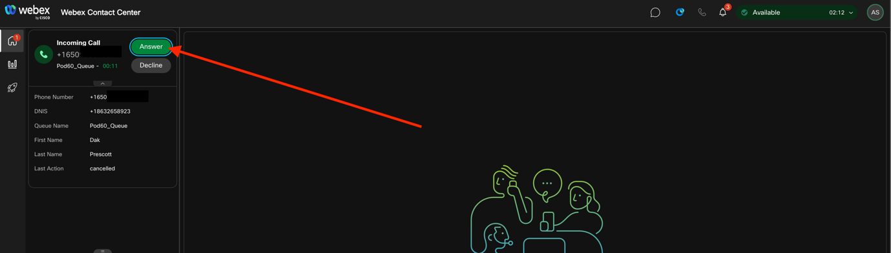

# LAB 3: - HUMAN AGENTS

## About this lab

Humans play a key role when CX is at risk. Therefore, they need to be
both leveraged efficiently and only when absolutely needed but they are
a strong option as well. They also must be equipped with the tools
needed to be effective since they are the ultimate safety net for the
end-user. Human support remains important for providing an authentic and
empathetic customer experience, which is needed for fostering customer
loyalty and building long-term relationship. Companies should strike a
balance by leveraging AI Agents for routine inquiries and ensuring a
smooth transition to human agents for complex issues.

Supporting human agents with training, tools, and customer data,
prioritizing the overall customer experience, and using technology to
enhance human interactions can help deliver excellent customer service
and build long-term customer relationships.

## Lab Objective

In this lab, we are concentrating on the third pillar Human Agents.

Upon completion of this lab, you will be able to: -

- Verify Webex Contact center sandbox configuration.

- Set up team and call drop queue to simulate call drop to deliver call
  drop summarization for the next agent.

- Verify call recording is enabled at the tenant level for Topic
  Analytics

- Enable webRTC for agent and supervisor call delivery.

- Create connectors to access Webex contact center API’s within flow
  builder.

- Enable Cisco AI assistant and features.

- Change the default layout to bootcamp layout to enable Cisco AI
  assistant and JDS.

- Import a new flow to deliver the customer call to an agent to process
  order cancellation.

- Test the flow by delivering the call to agent.

- Transfer the active call to call drop summary queue to simulate call
  drop.

- Re-test by calling again and going through self-service using AI Agent
  configured in lab 2.

- Verify Virtual agent transfer summary and call drop summary of the
  previous interactions delivered to the agent.

## Background

Lab 3 focuses on one of the most important pillars of the customer
experience portfolio, the human agents. Here we will be exploring the
various AI aspects to increase the efficiency of human agents to better
serve the customers quickly and efficiently. This will help business
increase their brand value while reducing the operations cost by
leveraging the existing workforce to solve customer needs much quicker.

By leveraging the proactive journey and Ai Agents, we hope to provide
better self-service capabilities for our customers. The best customer
experience is to provide self-service when you can and escalate to human
agents when needed. This makes the interactions that gets escalated to
human agents more complex and it is important to provide human agents
the required tools to ensure they provide the best possible service, but
in a quick and a very efficient way.

## AI Assistant

AI Assistant revolutionizes customer service by enhancing your
efficiency and elevating customer satisfaction.

Here is what the AI Assistant offers:

- **AI-generated call summaries** – Agents can now handle customer
  conversations better with AI-generated summaries.

- AI-generated summaries for dropped calls: If a call gets disconnected
  unexpectedly, the Cisco AI Assistant instantly creates a summary of
  the conversation. When the customer calls back, the next agent can
  seamlessly continue the conversation, saving time and enhancing the
  customer experience.

- Virtual agent transfer summaries: Provides the comprehensive summaries
  of interactions with virtual agents, ensuring the agents have all the
  information needed to assist customers quickly and efficiently. This
  means less repetition for customers and faster resolutions.

- **AI-powered Agent Wellbeing** - AI-powered Agent Wellbeing features
  are designed to support Agents’ wellbeing, enhance productivity, and
  customer satisfaction. Using advanced analytics, the Webex Contact
  Center platform harnesses end-to-end data insights to monitor and
  detect agents' stress levels in real-time. Using the real-time
  insights, the system provides automated wellbeing breaks when needed,
  helping agents manage stress effectively, sustain high performance,
  and deliver exceptional customer experiences.

- **Auto CSAT** - Auto CSAT forecasts customer satisfaction (CSAT) after
  each interaction, helping contact centers gain insights and make
  decisions to boost customer satisfaction and agent performance. CSAT
  is crucial for understanding customer happiness with service. Cisco's
  proprietary models use operational data, interaction transcripts, and
  surveys to predict CSAT scores accurately. These scores can identify
  training needs, select calls for review, and ensure swift resolution
  for dissatisfied customers.

- **Topic Analytics** – AI-powered Topic Analysis capability provides
  insights into the key reasons customers are calling into the contact
  center by collecting and analyzing interaction data and extracting
  trends. This capability, using large language models (LLMs), helps the
  organization to identify the top call drivers and probably use that as
  a first step towards self-service leveraging AI Agents.

  As part of this lab, we will only be testing the AI-generated call
  summaries because the other AI features rely on data to train and
  model which we don’t have in our lab sandbox.

  Now let us begin with the lab.

## Goal 1 – Verify WxCC Configuration.

1.  Login to the control hub using URL
    [https://admin.webex.com](https://admin.webex.com/) and login with
    the provided admin username and password. The format of the username
    is <admin#@ciscolivelab.wbx.ai>, where \# is your pod \#. Ex: - if
    the assigned pod is 60, the admin username is
    <admin60@ciscolivelab.wbx.ai>

    Upon successful login, you are now in Contact Center landing page as
    shown below.

    

    Please ignore the error message at the bottom right. This is only
    indicating limited admin rights.

2.  Next click on “Contact Center” and click on “Channels”.

    

3.  Using the search type in your Pod#, ex: - If you are assigned Pod
    60, type pod60 or alternatively you can find it in the list.

    

4.  Click on the
    Pod#\_EP# that belongs to your pod and note the support number that
    is assigned to the entry point. This will be the number to dial into
    the contact center and verify that the “Telephone Number” that you
    received along with your pod credentials is same as this number.

    

5.  Let us now verify the configuration of the team and queue. Click on
    “Teams” from the contact center main menu. In the search bar, type
    in your Pod# and the team displayed with the filter.

    

    Click on your team to verify the configuration.

    

6.  Next, we will verify the queue configuration. Click on Queue and in
    the search bar type in your pod# to display your queue.

    

    Click on the queue to open the configuration and verify the team
    assignment in the queue.

    

7.  In the “Contact Routing Settings” section, click the Pencil icon
    under the Actions Column in the Group Details and type in your pod#.
    There should be a blue tick to indicate the team assignment to this
    queue.

    

    

8.  Next, let us look at AI Assistant to observe the features that are
    enabled. Click on AI Assistant within the contact center main menu
    and observe the features enabled. For Agent Wellbeing and Auto CSAT,
    you can select all agents to be included, or you can limit this to
    certain group of individuals.

    

    

9.  Auto CSAT feature modeling is dependent on call recording and CSAT
    based survey responses. It uses the data from the CSAT survey scores
    to train the model to generate Auto CSAT scores. We have created a
    survey and mapped it to the Auto CSAT. This can be observed by
    clicking on Manage questions within Auto CSAT section of AI
    Assistant.

    

## Goal 1 – WxCC Flow Configuration.

In this section we will look at Webex Contact Center flow. We are not
going to build the flow from start to finish, instead we will just copy
an existing flow and modify the AI Agent node to include the AI Agent
that we created in Lab 2.

1.  From the contact center menu, click on Flows and find the flow that
    is named

    CiscoLive_WxCC_Flow.

    

2.  We will now make a Copy of this flow and modify it. To copy click on
    three dots 
    at the end of the CiscoLive_WxCC_Flow.

    

    

3.  Click copy to make a copy of the flow. Wait for few secs for the
    copy of the flow to show up in the list.

    

4.  Click on 
    at the end of the flow that starts with copy. If there are multiple
    flow names that start with “Copy\_” , find the one that is “Last
    edited by” your admin account name.

    

    

5.  When the flow opens, you may be presented with “Discover New
    Features”, you can click “Get Started” to start modifying the flow.

6.  At first, we will put the flow in edit mode to start our edits. To
    do so click the “Edit” toggle which can found next to the flow name.

    

    

7.  Click the 
    next to the flow name and click Edit Name. Change the flow name to
    Pod#\_Flow where \# is your pod number. Ex: If the pod assigned to
    you 60, the flow name is Pod60_Flow.

    

    

    

    Click Save.

8.  We will now modify the aiAgent labeled node to include the AI Agent
    that we built in lab 2. Click on the node that is labeled aiAgent.

    

9.  The configuration settings for the node will be displayed on the
    right of the screen. In case the configuration window doesn’t
    appear, click on the node and click the icon
    
    next to the search flow and the settings window will appear.

    

10. In the aiAgent settings, change the Virtual Agent to the virtual
    agent that was configured for your Pod in Lab 2. This is a drop
    down, so please select your virtual agent from the drop down.

    

11. We now need to modify the Queue node to change the Queue target to
    your Pod. Click on QueueCall node in the flow.

    

12. The configuration settings for the node will be displayed on the
    right of the screen. In case the configuration window doesn’t
    appear, click on the node and click the icon
    
    next to the search flow and the settings window will appear.

    

13. In the QueueCall settings, in the Contact Handling section, change
    the Queue to your pod queue by clicking on the drop down.

    

    

    

14. When your changes are done, save the flow by clicking on the Save
    button. The save button will appear only if “Auto Save” is disabled.
    Auto save automatically saves the flow.

    

15. We are done with the changes and to make it live, toggle the
    validation button for error checking.

    

16. Now click the “Publish flow” to put the flow in production.

    

17. Publish Flow screen appears. This allows you to add version labels
    to build a lifecycle of the flow through various phases such as
    development, test, and live. Instead of applying changes directly to
    the flow, you can publish the flow through phases before you deploy
    the flow to the production. This feature helps you avoid overwriting
    of your current flow in the production.

    For this lab, we will leave the version label as “latest” which is
    default and is automatically added. Click Publish Flow again.

    

18. The flow is now published.

    

19. We can close the flow designer and link the flow to your voice
    channel.

20. Go back to control hub using the <https://admin.webex.com> and login
    with the admin username and password.

21. Click on Channels in the contact center menu. In the search under
    the channels, type your pod number to narrow down the list to your
    channel name.

    

22. Click on your channel to open the configuration window and go to the
    Entry Point Settings section.

    

    - Routing Flow: Select the flow for your pod from the drop down.

    - Version Label: Select the “latest” version label.

    - Music on Hold: Select a music on hold file from the list.

    - Click Save

    

  We are now ready to begin our testing of Lab 3.

## Testing.

### Background

We are now ready to test the flow that was created. The agents logging
in will use webRTC for the voice calls and when the customer call is
delivered to the agent, we will verify the information that is
presented. As the customer navigates through the brand experience,
journey data is checked to understand the customer journey. We will
simulate a system call drop. After the call gets dropped, another call
is placed and this time the customer interacts with the Ai agent and
then escalates the call to the human agent. When the call is presented
on the agent desktop, Virtual agent transcript, virtual agent transfer
summary and call drop summary is presented for this call.

1.  Open a web browser and go to [Desktop
    URL](https://desktop.wxcc-us1.cisco.com/).

2. Login with the provided agent credentials.

3. In the station credentials screen, select Desktop as the open and
    select the team that belongs to your pod. Then click submit.

    

4. Since this is the first time the agent is logging in, Emergency
    Service Notification disclaimer is presented. Check the box for “I
    have read the notification” and click Continue.

    

5. When you login for the first time using webRTC, if you get a warning
    message to allow microphone, select allow.

    

6. When successfully connected to webRTC, you will see “Desktop
    telephony connected successfully status message. The desktop is now
    ready to handle incoming calls.

    

7. We can now call in. Dial the telephone number that was assigned to
    you. This is number can also be found from Goal 1 – Verify WxCC
    Configuration. Step# [4](#_Ref194847514).

8. You will be greeted with the below greeting.

    “Hello, \<first name\> \<last name\>. Thank you for calling. Please
    note, we have an active order for \<product name\> associated with
    your account. Your order ID is \<order id\>. If you are enquiring
    about \<order id\>, press 1. For assistance with a different matter,
    press 2.”

    Press 1 to enquire about your existing order.

9. The next prompt will inform you about your SMS interaction (as
    completed in lab 2). You should hear the prompt “Our records show
    that you recently interacted with us via SMS and requested to cancel
    your order with Order ID \<order id\>. To confirm if you wish to
    cancel this order, press 1. If you’d like to speak with a
    representative press 2”.

10. Press 1 to cancel the order.

11. At this step, if you hear a different message other than the above
    message with option to cancel, it is because the last step in lab 2
    was not to cancel order. please check the output from JDS since the
    last step in lab 2 is to cancel the order.

12. If the delivery status is set to “shipped”, you will hear the
    message, “Thank you for your patience. Since the status of your
    order shows as 'Shipped,' you'll need to speak with a representative
    to proceed with the cancellation. Please hold for the next available
    representative”. If the delivery status is set to anything other
    than “shipped” status, you will hear the message “Thank you for your
    patience. Please hold for the next available representative”.

13. You will hear the hold music followed by the queue message “Thank
    you for holding. Your call is important to us, and a representative
    will be with you shortly. Please continue to hold, and we appreciate
    your patience”.

14. On the agent desktop, set the agent status to “Available” state.

    

    

15. If the agent is logged into the appropriate team, the call should be
    delivered to the agent. Please refer to the incoming pop over for
    the call information.

    

16. Click Answer, to answer the call.

    

17. When the call is answered, observe the agent desktop interaction
    control pane for the call information details.

    

18. The customer journey widget will show the customer journey.

    

19. Expand on an interaction in the customer journey widget to view the
    details.

    

    

20. Pretend to be the customer and have a conversation with the agent
    regarding the product or cancellation policy for about 30secs.

21. We will now simulate a system call drop by transferring the call to
    a queue that will drop after 15secs.

22. While the call is active on the agent desktop, click on the transfer
    button.

    

23. In the transfer request window, select the radio button next to
    Queue.

    

24. Hit the drop-down selection to choose from the list of queues and
    select “Call drop summary-Q”

    

    

25. Click on transfer to complete the call transfer.

    

26. Select the wrap up reason to complete the call.

    

27. Dial the number again

28. You will be greeted with the below greeting.

    “Hello, \<first name\> \<last name\>. Thank you for calling. Please
    note, we have an active order for \<product name\> associated with
    your account. Your order ID is \<order id\>. If you are enquiring
    about \<order id\>, press 1. For assistance with a different matter,
    press 2.”

    This time Press 2 for different matter.

29. You will hear the welcome message configured for your Ai Agent
    within the Ai agent studio.

    

30. Have a conversation with the Ai Agent based on the agent’s goal
    defined in lab 2.

31. Ask the Ai Agent to transfer to the call to an agent.

32. If the agent is logged into the appropriate team, the call should be
    delivered to the agent. Click Answer button to answer the call.

33. When the call is answered, the transcript from the Ai Agent is
    delivered to the agent desktop.

    

34. When the call is answered, Cisco Ai Assistant pops up with virtual
    agent transfer summary, and the call drop summary of the previous
    disconnected call.

    

35. We are done servicing the customer and the agent disconnects the
    call to transfer the customer to post call survey.

36. From the agent desktop, click the End button to end the call. The
    customer should hear the survey option. Please select a rating from
    1-5 for CSAT.

    

37. On the agent desktop, select the appropriate wrap-up reason code to
    clear the call.

38. The survey results take upto 24 hours to show up within the control
    hub.

39. Login to control hub using your admin username and password and
    navigate to Contact Center.

40. From the contact center main menu, click on surveys. The responses
    column will show the number of surveys completed. The survey results
    can be viewed by clicking the download button.

    

41. Auto CSAT gets populated in Supervisor Desktop when it has
    sufficient data modeling available to show the Auto CSAT scores.
    Login to the supervisor desktop using URL [Supervisor
    Desktop](https://desktop.wxcc-us1.cisco.com/)

    Use the supervisor login and password to login.

    At the station credentials pop up, select supervisor as the role and
    select desktop for the telephony option.

    

42. When logged in, navigate to the recordings widget on the left pane
    of the supervisor desktop.

    

43. Adjust the date filter to show the recordings. Note the Auto CSAR
    column is blank and this is expected since there isn’t sufficient
    data available for Auto CSAT to populate.

    

    **Congratulations!! This concludes Lab 3.**
